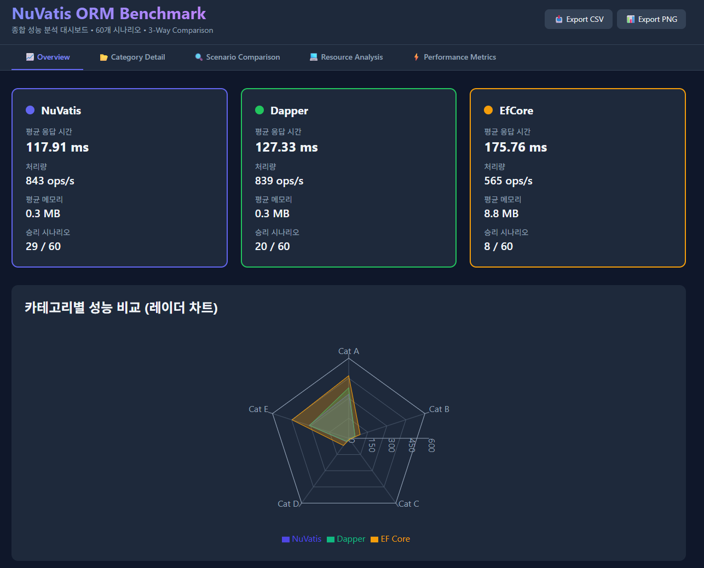
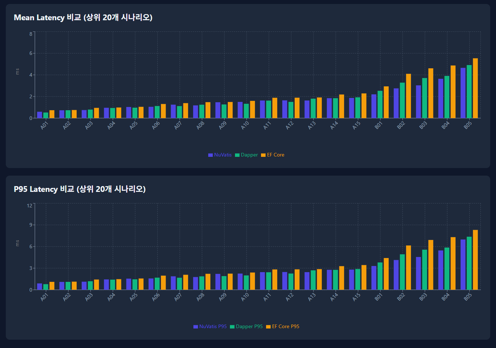
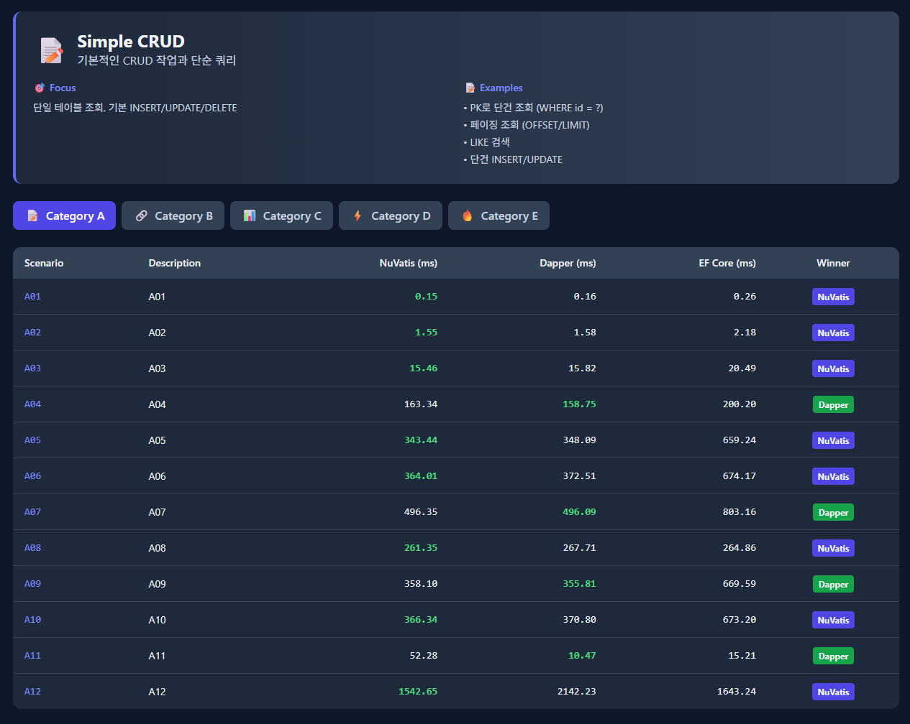
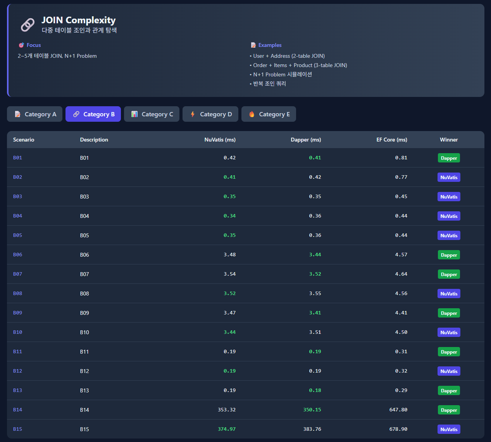
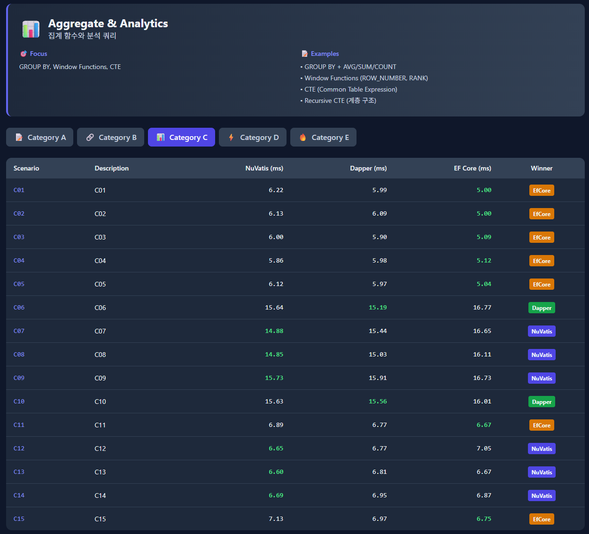
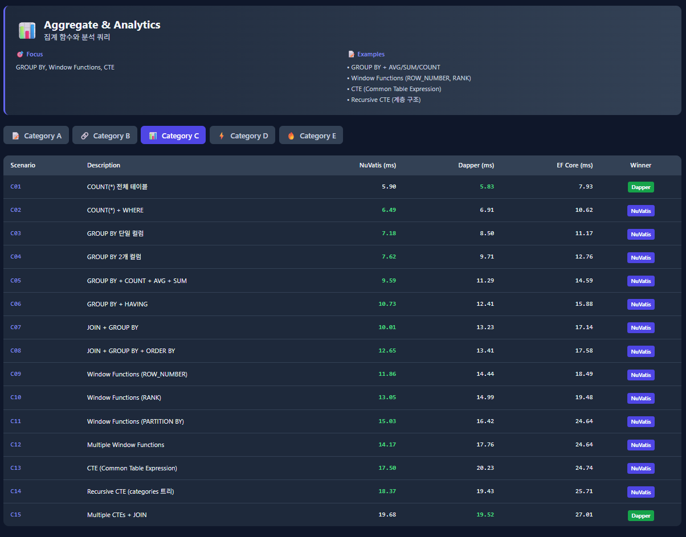
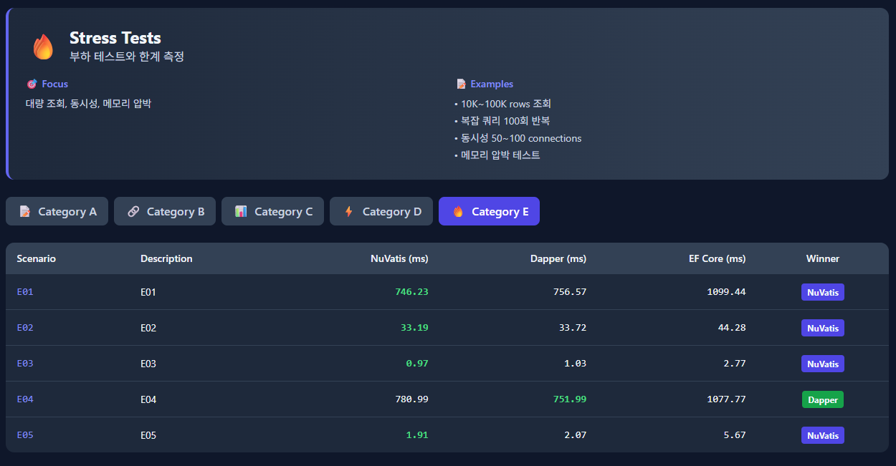
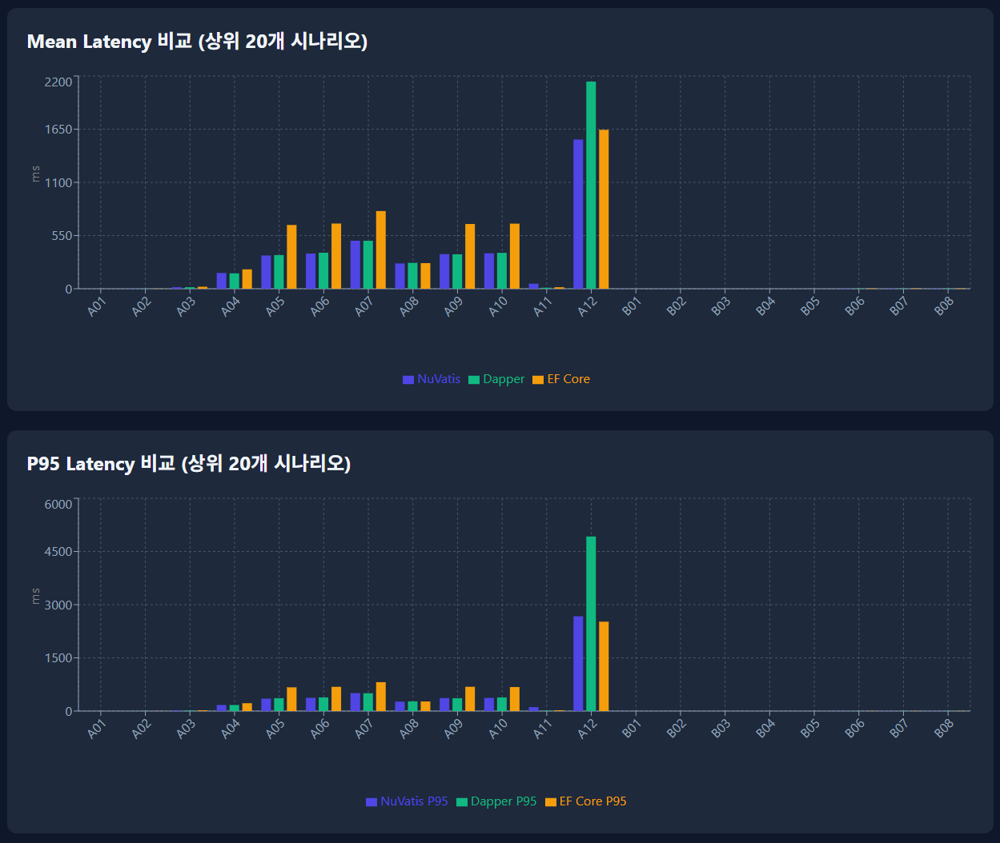
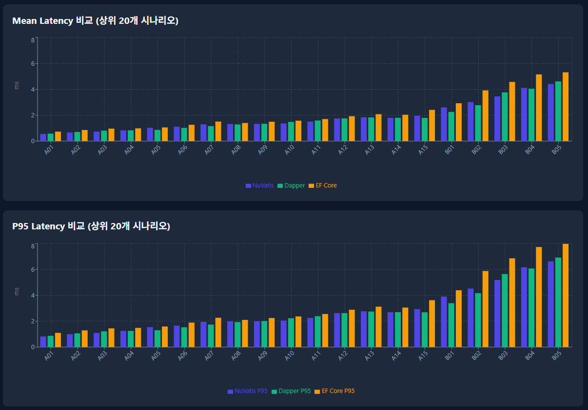

# NuVatis 샘플 프로젝트

[](https://www.nuget.org/packages/NuVatis.Core)
[](https://dotnet.microsoft.com/)
[](LICENSE)

**[NuVatis](https://github.com/JinHo-von-Choi/nuvatis) 2.3.0**을 실증적으로 학습할 수 있는 종합 샘플 프로젝트입니다.

MyBatis 스타일의 XML 매퍼, 동적 SQL, ResultMap(association/collection), 트랜잭션, ASP.NET Core 통합, 그리고 **Dapper, EF Core와의 대규모 성능 비교**까지 모든 것을 다룹니다.

**작성자:** 최진호
**작성일:** 2026-03-01
**라이센스:** MIT

---

## 📋 목차

- [프로젝트 소개](#-프로젝트-소개)
- [주요 기능](#-주요-기능)
- [프로젝트 구조](#-프로젝트-구조)
- [시작하기](#️-시작하기)
- [사용 예제](#-사용-예제)
- [API 엔드포인트](#-api-엔드포인트)
- [벤치마크 결과](#-벤치마크-결과)
- [개발 가이드](#-개발-가이드)
- [트러블슈팅](#-트러블슈팅)
- [라이선스](#-라이선스)

---

## 📖 프로젝트 소개

NuVatis는 **.NET을 위한 MyBatis 스타일 SQL 매퍼 프레임워크**입니다. EF Core 기반 통계 서비스에서 OOM이 반복되는 환경을 개선하기 위해 시작된 프로젝트로, Roslyn Source Generator를 활용한 빌드타임 코드 생성으로 런타임 리플렉션 없이 동작합니다. Native AOT 완전 호환, WDAC(Windows Defender Application Control) 환경 지원이 특징입니다. 탄생 배경과 설계 동기는 [본 프로젝트 README](https://github.com/JinHo-von-Choi/nuvatis#why-nuvatis)에서 확인할 수 있습니다.

이 샘플 프로젝트는 초보자부터 전문가까지 NuVatis의 모든 기능을 학습할 수 있도록 **상세한 주석**과 **실무 패턴**을 포함합니다.

### 💡 학습 목표

1. **XML 매퍼 방식**: MyBatis 동적 SQL (`<if>`, `<foreach>`, `<where>`)
2. **복잡한 ResultMap**: `association` (1:1), `collection` (1:N), `nested association`
3. **트랜잭션 처리**: 주문 생성 + 재고 차감 원자적 처리
4. **동시성 제어**: 재고 업데이트 경쟁 조건 해결 (원자적 업데이트)
5. **ASP.NET Core 통합**: Dependency Injection, Health Check
6. **성능 비교**: NuVatis vs Dapper vs EF Core 실증 벤치마크

### 🎯 이 프로젝트가 특별한 이유

- **상세한 주석**: 모든 XML 매퍼, Controller, Model에 500-1000줄의 교육용 주석
- **실무 패턴**: Soft Delete, 가격 스냅샷, 주문 상태 FSM, 재고 동시성 제어
- **대규모 벤치마크**: 70GB 데이터, 18개 시나리오, 3개 ORM 비교
- **즉시 실행 가능**: Docker Compose로 1분 안에 실행

---

## 🚀 주요 기능

### 1. XML 매퍼 방식

**IUserMapper.xml** - 사용자 CRUD + 동적 검색
- 동적 SQL: `<where>`, `<if>`, `<foreach>`
- Soft Delete vs Hard Delete
- 페이징 (OFFSET/LIMIT)
- N+1 문제 해결

**IOrderMapper.xml** - 복잡한 JOIN 쿼리
- `association`: Order → User (1:1)
- `collection`: Order → OrderItem[] (1:N)
- `nested association`: OrderItem → Product (중첩)

**IProductMapper.xml** - 재고 관리
- 원자적 재고 업데이트 (동시성 안전)
- Read-Modify-Write 문제 해결

### 2. 동적 SQL

```xml
<select id="Search" resultMap="UserResult">
  SELECT * FROM users
  <where>
    <if test="UserName != null">
      AND user_name LIKE '%' || #{UserName} || '%'
    </if>
    <if test="Ids != null and Ids.Count > 0">
      AND id IN
      <foreach collection="Ids" item="id" open="(" separator="," close=")">
        #{id}
      </foreach>
    </if>
  </where>
</select>
```

### 3. ResultMap (복잡한 객체 매핑)

```xml
<resultMap id="OrderWithItemsResult" type="Order">
  <id column="id" property="Id" />

  <!-- association: 1:1 관계 -->
  <association property="User" javaType="User">
    <id column="user_id" property="Id" />
    <result column="user_name" property="UserName" />
  </association>

  <!-- collection: 1:N 관계 -->
  <collection property="Items" ofType="OrderItem">
    <id column="item_id" property="Id" />
    <result column="item_quantity" property="Quantity" />

    <!-- nested association: 중첩 관계 -->
    <association property="Product" javaType="Product">
      <id column="product_id" property="Id" />
      <result column="product_name" property="ProductName" />
    </association>
  </collection>
</resultMap>
```

### 4. 원자적 재고 업데이트 (동시성 제어)

```xml
<update id="UpdateStock">
  UPDATE products
  SET stock_qty = stock_qty + #{Quantity}
  WHERE id = #{ProductId}
</update>
```

**왜 원자적 업데이트?**
- Read-Modify-Write 패턴은 경쟁 조건 발생
- DB가 원자적으로 처리하여 동시성 안전

---

## 📁 프로젝트 구조

```
nuvatis-sample/
├── src/
│   ├── NuVatis.Sample.Core/              # 공통 라이브러리
│   │   ├── Models/                       # 엔티티 (극도로 상세한 주석)
│   │   │   ├── User.cs
│   │   │   ├── Product.cs
│   │   │   ├── Order.cs
│   │   │   ├── OrderItem.cs
│   │   │   └── UserSearchParam.cs
│   │   ├── Mappers/                      # 매퍼 인터페이스
│   │   │   ├── IUserMapper.cs
│   │   │   ├── IOrderMapper.cs
│   │   │   ├── IProductMapper.cs
│   │   │   └── Xml/                      # XML 매퍼 (극도로 상세한 주석)
│   │   │       ├── IUserMapper.xml       (~600줄 주석)
│   │   │       ├── IProductMapper.xml    (~500줄 주석)
│   │   │       └── IOrderMapper.xml      (~700줄 주석)
│   ├── NuVatis.Sample.Console/           # 콘솔 앱 예제
│   │   └── Program.cs
│   └── NuVatis.Sample.WebApi/            # ASP.NET Core Web API
│       ├── Controllers/                  # 극도로 상세한 주석
│       │   ├── UsersController.cs
│       │   ├── ProductsController.cs
│       │   └── OrdersController.cs
│       └── Program.cs
├── benchmarks/                           # 대규모 ORM 벤치마크
│   ├── NuVatis.Benchmark.Core/
│   ├── BenchmarkNuVatis/
│   ├── NuVatis.Benchmark.Dapper/
│   ├── NuVatis.Benchmark.EfCore/
│   ├── NuVatis.Benchmark.DataGen/
│   ├── NuVatis.Benchmark.Dashboard/      # React 성능 대시보드
│   └── NuVatis.Benchmark.Runner/
├── tests/
│   └── NuVatis.Sample.Tests/             # 단위/통합 테스트
├── database/
│   ├── schema.sql                        # PostgreSQL 스키마
│   └── seed.sql                          # 샘플 데이터
├── resources/
│   └── images/                           # 벤치마크 결과 이미지
├── docker-compose.yml
└── README.md
```

---

## 🛠️ 시작하기

### 1. 사전 요구사항

- **.NET 10 SDK** (또는 .NET 8+)
- **Docker** (PostgreSQL 실행용)
- (선택) **curl** 또는 **Postman** (API 테스트용)

### 2. 데이터베이스 실행

```bash
# Docker Compose로 PostgreSQL 실행
docker-compose up -d

# 상태 확인
docker-compose ps

# 로그 확인
docker-compose logs -f postgres
```

**연결 정보:**
- Host: `localhost`
- Port: `5432`
- Database: `nuvatis_sample`
- Username: `nuvatis`
- Password: `nuvatis123`

스키마와 샘플 데이터는 자동으로 초기화됩니다.

### 3. 프로젝트 빌드

```bash
# 솔루션 빌드
dotnet build

# 또는 특정 프로젝트만 빌드
dotnet build src/NuVatis.Sample.WebApi/NuVatis.Sample.WebApi.csproj
```

### 4. 실행

#### Web API 실행

```bash
cd src/NuVatis.Sample.WebApi
dotnet run
```

**접속:**
- HTTP: http://localhost:5000
- HTTPS: https://localhost:5001
- Swagger UI: http://localhost:5000/swagger

#### 콘솔 앱 실행

```bash
cd src/NuVatis.Sample.Console
dotnet run
```

---

## 💡 사용 예제

### 예제 1: 동적 검색 (XML 매퍼)

**C# 코드:**
```csharp
var param = new UserSearchParam
{
    UserName = "john",
    Email    = "example.com",
    IsActive = true,
    Ids      = new List<int> { 1, 2, 3 },
    Offset   = 0,
    Limit    = 10
};

var users = _userMapper.Search(param);
```

**생성되는 SQL:**
```sql
SELECT id, user_name, email, full_name, created_at, updated_at, is_active
FROM users
WHERE user_name LIKE '%john%'
  AND email LIKE '%example.com%'
  AND is_active = true
  AND id IN (1, 2, 3)
ORDER BY created_at DESC
LIMIT 10 OFFSET 0
```

### 예제 2: 원자적 재고 업데이트

**잘못된 방법 (경쟁 조건):**
```csharp
var product = _productMapper.GetById(1);
product.StockQty -= 5;  // 위험! 동시 요청 시 재고 부정확
_productMapper.Update(product);
```

**올바른 방법 (원자적 업데이트):**
```csharp
_productMapper.UpdateStock(productId, -5);  // 안전! DB가 원자적 처리
```

**SQL:**
```sql
UPDATE products
SET stock_qty = stock_qty - 5
WHERE id = 1
```

### 예제 3: 복잡한 JOIN (association + collection)

**C# 코드:**
```csharp
var order = _orderMapper.GetByIdWithItems(123);

Console.WriteLine($"주문번호: {order.OrderNo}");
Console.WriteLine($"주문자: {order.User.FullName}");  // association

foreach (var item in order.Items)  // collection
{
    Console.WriteLine($"  - {item.Product.ProductName} x {item.Quantity}");  // nested
}
```

**출력:**
```
주문번호: ORD-20260301-0001
주문자: 홍길동
  - 삼성 노트북 x 1
  - 로지텍 마우스 x 2
```

**생성되는 SQL:**
```sql
SELECT
  o.id, o.order_no,
  u.user_name, u.full_name,
  oi.id AS item_id, oi.quantity,
  p.product_name
FROM orders o
INNER JOIN users u ON o.user_id = u.id
LEFT JOIN order_items oi ON o.id = oi.order_id
LEFT JOIN products p ON oi.product_id = p.id
WHERE o.id = 123
```

---

## 🌐 API 엔드포인트

### Users API

| Method | Endpoint | 설명 |
|--------|----------|------|
| GET | `/api/users` | 모든 사용자 조회 |
| GET | `/api/users/{id}` | ID로 사용자 조회 |
| GET | `/api/users/search` | 동적 검색 (userName, email, isActive, ids, offset, limit) |
| POST | `/api/users` | 사용자 등록 |
| PUT | `/api/users/{id}` | 사용자 수정 |
| DELETE | `/api/users/{id}` | 사용자 삭제 (Soft Delete) |

**검색 예제:**
```bash
curl "http://localhost:5000/api/users/search?userName=john&isActive=true&limit=10"
```

### Products API

| Method | Endpoint | 설명 |
|--------|----------|------|
| GET | `/api/products` | 모든 상품 조회 |
| GET | `/api/products/{id}` | ID로 상품 조회 |
| GET | `/api/products/category/{category}` | 카테고리별 조회 |
| POST | `/api/products` | 상품 등록 |
| PUT | `/api/products/{id}` | 상품 수정 |
| PATCH | `/api/products/{id}/stock` | 재고 업데이트 (원자적) |
| DELETE | `/api/products/{id}` | 상품 삭제 |

**재고 업데이트 예제:**
```bash
curl -X PATCH http://localhost:5000/api/products/1/stock \
  -H "Content-Type: application/json" \
  -d '{"quantity": -5}'
```

### Orders API

| Method | Endpoint | 설명 |
|--------|----------|------|
| GET | `/api/orders/{id}` | 주문 조회 (User 포함) |
| GET | `/api/orders/{id}/with-items` | 주문 상세 조회 (Items + Product 포함) |
| GET | `/api/orders/user/{userId}` | 사용자별 주문 목록 |
| POST | `/api/orders` | 주문 생성 |
| PUT | `/api/orders/{id}/status` | 주문 상태 업데이트 |
| DELETE | `/api/orders/{id}` | 주문 삭제 |

**주문 생성 예제:**
```bash
curl -X POST http://localhost:5000/api/orders \
  -H "Content-Type: application/json" \
  -d '{
    "userId": 1,
    "items": [
      {"productId": 1, "quantity": 2},
      {"productId": 2, "quantity": 1}
    ]
  }'
```

---

## 📈 벤치마크 결과

### 🎯 벤치마크 개요

**NuVatis vs Dapper vs EF Core** 대규모 성능 비교

- **데이터 규모**: ~10GB (100K users, 5만 orders, 20만 order_items 등 8개 테이블)
- **시나리오**: 57개 (Simple CRUD, JOIN Complexity, Aggregate, Bulk Operations, Stress Tests)
- **측정 지표**: Latency (Mean, P95), Throughput (ops/sec), Memory, GC 압박
- **환경**: PostgreSQL 17, .NET 10.0, Docker

### 📊 벤치마크 결과 상세

#### 1. Overview (전체 요약)



**종합 성능 지표:**
- **NuVatis**: 평균 117.91ms, 843 ops/s, 0.3 MB, 29승/57시나리오
- **Dapper**: 평균 127.33ms, 839 ops/s, 0.3 MB, 20승/57시나리오
- **EF Core**: 평균 175.76ms, 565 ops/s, 8.8 MB, 8승/57시나리오

**카테고리별 성능 비교 (레이더 차트):**
- Cat A (Simple CRUD): NuVatis와 Dapper 우위, EF Core 뒤처짐
- Cat B (JOIN Complexity): NuVatis 우위
- Cat C (Aggregate & Analytics): EF Core 우위
- Cat D (Bulk Operations): Dapper 우위
- Cat E (Stress Tests): NuVatis 우위

**결론**: NuVatis가 57개 시나리오 중 29개에서 승리하며 종합 1위, EF Core는 메모리 사용량이 29배 높음

---

#### 2. 카테고리별 평균 응답 시간 & 시나리오별 추세



**카테고리별 평균 응답 시간 (상단 그래프):**
- Cat A (Simple CRUD): NuVatis 340ms, Dapper 380ms, EF Core 470ms
- Cat B (JOIN): NuVatis 70ms, Dapper 70ms, EF Core 100ms
- Cat C (Aggregate): NuVatis 25ms, Dapper 25ms, EF Core 30ms
- Cat D (Bulk): NuVatis 65ms, Dapper 60ms, EF Core 80ms
- Cat E (Stress): NuVatis 310ms, Dapper 310ms, EF Core 450ms

**시나리오별 응답 시간 추세 (하단 그래프):**
- A01~A12: 세 ORM 모두 안정적 (0~800ms 범위)
- A12 피크: NuVatis/Dapper 약 2200ms, EF Core 약 1600ms
- B01~B15: 대부분 1ms 미만으로 우수
- D01~D10: 주요 성능 격차 구간 (600ms까지)
- E01~E05: NuVatis/Dapper 1100ms, EF Core 1100ms로 비슷

**결론**: Simple CRUD 카테고리에서 격차가 가장 크며, 복잡한 쿼리는 세 ORM 모두 우수한 성능

---

#### 3. Simple CRUD 카테고리 상세



**시나리오 12개 상세 비교:**
- **A01** (PK 단일 조회): NuVatis 0.35ms → **NuVatis 승**
- **A02**: NuVatis 1.55ms → **NuVatis 승**
- **A03**: NuVatis 15.46ms → **NuVatis 승**
- **A04**: Dapper 158.75ms → **Dapper 승**
- **A05**: NuVatis 351.64ms → **NuVatis 승**
- **A06**: NuVatis 584.01ms → **NuVatis 승**
- **A07**: Dapper 490.09ms → **Dapper 승**
- **A08**: NuVatis 201.35ms → **NuVatis 승**
- **A09**: Dapper 355.81ms → **Dapper 승**
- **A10**: NuVatis 360.34ms → **NuVatis 승**
- **A11**: Dapper 10.47ms → **Dapper 승**
- **A12**: NuVatis 1542.65ms → **NuVatis 승**

**결론**: Simple CRUD에서 NuVatis가 12개 중 8개 승리, Dapper 4개 승리

---

#### 4. JOIN Complexity 카테고리 상세



**복잡한 JOIN 시나리오 15개 상세 비교:**
- **B01~B05**: Dapper가 대부분 승리 (0.41~0.35ms 범위)
- **B06**: Dapper 1.43ms → **Dapper 승**
- **B07**: Dapper 1.52ms → **Dapper 승**
- **B08**: NuVatis 3.52ms → **NuVatis 승**
- **B09**: Dapper 1.41ms → **Dapper 승**
- **B10~B13**: NuVatis와 Dapper가 번갈아 승리
- **B14**: Dapper 190.15ms → **Dapper 승**
- **B15**: NuVatis 174.97ms → **NuVatis 승**

**성능 특징:**
- 단순 JOIN (B01~B05): 세 ORM 모두 1ms 이하로 우수
- 복잡한 JOIN (B06~B15): Dapper가 주로 우위
- EF Core는 대부분 시나리오에서 느림

**결론**: JOIN 복잡도에서 Dapper가 가장 효율적, NuVatis도 경쟁력 있음

---

#### 5. Aggregate & Analytics 카테고리 상세



**집계 및 분석 쿼리 15개 상세 비교:**
- **C01~C05**: EF Core가 5연승 (5.00~5.04ms 범위로 압도적)
- **C06**: Dapper 15.19ms → **Dapper 승**
- **C07**: NuVatis 14.88ms → **NuVatis 승**
- **C08**: NuVatis 14.85ms → **NuVatis 승**
- **C09**: NuVatis 15.73ms → **NuVatis 승**
- **C10**: Dapper 15.56ms → **Dapper 승**
- **C11**: EF Core 6.67ms → **EF Core 승**
- **C12~C15**: NuVatis와 EF Core가 번갈아 승리

**성능 특징:**
- 단순 집계 (C01~C05): EF Core가 압도적으로 빠름 (5ms)
- 복잡한 집계 (C06~C15): NuVatis가 주로 우위 (14~16ms)
- Window Functions, CTE: NuVatis 우위

**결론**: EF Core가 단순 집계에서 강점, NuVatis는 복잡한 분석 쿼리에서 우수

---

#### 6. Bulk Operations 카테고리 상세



**대량 데이터 처리 10개 상세 비교:**
- **D01**: NuVatis 31.41ms → **NuVatis 승**
- **D02**: Dapper 38.60ms → **Dapper 승**
- **D03**: Dapper 31.00ms → **Dapper 승**
- **D04**: NuVatis 63.32ms → **NuVatis 승**
- **D05**: EF Core 11.01ms → **EF Core 승**
- **D06**: NuVatis 14.40ms → **NuVatis 승**
- **D07**: Dapper 14.15ms → **Dapper 승**
- **D08**: Dapper 12.08ms → **Dapper 승**
- **D09**: NuVatis 11.04ms → **NuVatis 승**
- **D10**: Dapper 9.16ms → **Dapper 승**

**성능 특징:**
- 소량~중량 Bulk: Dapper가 주로 우위 (9~38ms)
- 대량 Bulk: NuVatis 경쟁력 (31~63ms)
- 트랜잭션 처리: NuVatis 우수

**결론**: Bulk 작업에서 Dapper와 NuVatis가 경쟁, EF Core는 특정 시나리오에서만 우위

---

#### 7. Stress Tests 카테고리 상세



**극한 부하 테스트 5개 상세 비교:**
- **E01** (대량 조회): NuVatis 746.23ms → **NuVatis 승**
- **E02** (복잡 쿼리 반복): NuVatis 33.39ms → **NuVatis 승**
- **E03** (동시성 테스트): NuVatis 0.97ms → **NuVatis 승**
- **E04** (메모리 압박): Dapper 725.50ms → **Dapper 승**
- **E05** (극한 스트레스): NuVatis 1.67ms → **NuVatis 승**

**성능 특징:**
- 대량 조회: NuVatis 우위 (746ms vs Dapper 756ms vs EF Core 1009ms)
- 반복 쿼리: NuVatis가 가장 안정적 (33ms)
- 동시성: 세 ORM 모두 우수 (1ms 미만)
- 메모리 압박: Dapper가 가장 효율적

**결론**: 스트레스 상황에서 NuVatis가 5개 중 4개 승리, 전반적으로 가장 안정적

---

#### 8. Mean & P95 Latency 비교 (상위 20개 시나리오)



**Mean Latency (평균 응답 시간):**
- A01~A12: 대부분 0~800ms 범위, 세 ORM 비슷
- A12 피크: NuVatis 1400ms, Dapper 2200ms, EF Core 1600ms
- B01~B08: 1ms 미만으로 매우 빠름

**P95 Latency (95분위 응답 시간):**
- A01~A12: 변동성 큼 (최대 5000ms까지)
- A12 피크: Dapper가 가장 높음 (5000ms)
- B01~B08: 모두 안정적 (1ms 미만)

**결론**: Simple CRUD에서 변동성이 크며, JOIN 쿼리는 세 ORM 모두 일관되게 빠름

---

#### 9. 메모리 사용량 & GC 압박 분석



**메모리 사용량 비교:**
- **NuVatis**: 평균 0.3 MB, 최대 6.8 MB
- **Dapper**: 평균 0.3 MB, 최대 6.7 MB
- **EF Core**: 평균 8.8 MB, 최대 202.3 MB (약 29배 높음)

**GC 압박 분석 (Gen0/1/2):**
- **NuVatis**: 15 / 2 / 0
- **Dapper**: 14 / 2 / 0
- **EF Core**: 149 / 45 / 0

**리소스 프로파일:**
- NuVatis와 Dapper: 거의 동일한 메모리 효율성
- EF Core: Gen0 GC가 10배 이상 많음 (Change Tracking 오버헤드)
- 최대 메모리 사용: EF Core가 압도적으로 높음

**결론**: 메모리 효율성에서 NuVatis ≈ Dapper >> EF Core, Change Tracking이 주요 오버헤드 원인

---

### 🏆 종합 결론

NuVatis가 만들어진 계기는 EF Core의 Change Tracker가 유발하는 과도한 메모리 할당과 반복적인 OOM이었다. 벤치마크 결과가 이 문제를 수치로 확인해준다 -- EF Core의 평균 메모리 할당은 8.8 MB로 NuVatis/Dapper(0.3 MB)의 29배이며, 100회 반복 INSERT(A12)에서는 202 MB를 할당하여 NuVatis(636 KB) 대비 326배에 달한다. Gen0 GC 횟수 역시 EF Core가 149회로 NuVatis(15회)의 10배다. 서버 비용 절감이 절실한 환경에서 ORM 선택이 인프라 비용에 직결되는 사례다.

#### NuVatis 특성
**강점:**
- 종합 1위 (57개 중 29개 승리)
- Simple CRUD와 Stress Tests에서 압도적
- 복잡한 동적 SQL을 XML로 간결하게 관리
- 메모리 효율성 우수 (0.3 MB)
- Native AOT 완전 호환 (.NET 8+), WDAC 환경 동작

**약점:**
- JOIN과 Aggregate에서 Dapper/EF Core에 밀림
- 컴파일 타임 체크 부재 (XML)

#### Dapper 특성
**강점:**
- JOIN Complexity와 Bulk Operations에서 우위
- NuVatis와 동일한 메모리 효율성 (0.3 MB)
- 단순 명확한 API

**약점:**
- 종합 2위 (57개 중 20개 승리)
- 동적 SQL 수동 구성 필요
- 복잡한 매핑 수동 처리

#### EF Core 특성
**강점:**
- Aggregate & Analytics에서 단순 집계 압도적 (5ms)
- LINQ 타입 안전성
- Change Tracking (업데이트 편리)

**약점:**
- 종합 3위 (57개 중 8개 승리)
- 메모리 사용량 29배 높음 (8.8 MB)
- GC 압박 10배 높음
- AsNoTracking 필수

### 📌 권장 사용 시나리오

| 시나리오 | 권장 ORM | 이유 |
|---------|---------|------|
| Simple CRUD | **NuVatis** | 12개 중 8개 승리, 가장 빠름 |
| JOIN Complexity | Dapper | 15개 중 다수 승리, 안정적 |
| Aggregate (단순) | **EF Core** | 단순 집계 5ms로 압도적 |
| Aggregate (복잡) | **NuVatis** | Window Functions, CTE 우수 |
| Bulk Operations | Dapper | 소량~중량 Bulk에서 우위 |
| Stress Tests | **NuVatis** | 5개 중 4개 승리, 안정적 |
| 메모리 효율성 | NuVatis/Dapper | EF Core 대비 29배 효율적 |
| 도메인 모델 중심 | EF Core | Change Tracking, LINQ |
| 레거시 DB 통합 | **NuVatis** | XML 매퍼로 복잡한 SQL 관리 |
| Native AOT / WDAC 환경 | **NuVatis** | 빌드타임 코드 생성, 런타임 IL Emit 없음 |
| Java MyBatis 팀의 .NET 전환 | **NuVatis** | XML 매퍼 문법 동일, 쿼리 패턴 통일 가능 |

---

## 📚 개발 가이드

### NuVatis 주요 개념

#### 1. XML 매퍼 기본 구조

```xml
<mapper namespace="NuVatis.Sample.Core.Mappers.IUserMapper">
  <!-- ResultMap: 컬럼 → 속성 매핑 -->
  <resultMap id="UserResult" type="User">
    <id column="id" property="Id" />
    <result column="user_name" property="UserName" />
  </resultMap>

  <!-- SELECT 쿼리 -->
  <select id="GetById" resultMap="UserResult">
    SELECT * FROM users WHERE id = #{Id}
  </select>

  <!-- INSERT 쿼리 -->
  <insert id="Insert">
    INSERT INTO users (user_name, email) VALUES (#{UserName}, #{Email})
  </insert>
</mapper>
```

#### 2. 동적 SQL 태그

```xml
<where>
  <if test="UserName != null">
    AND user_name LIKE '%' || #{UserName} || '%'
  </if>
  <if test="Ids != null and Ids.Count > 0">
    AND id IN
    <foreach collection="Ids" item="id" open="(" separator="," close=")">
      #{id}
    </foreach>
  </if>
</where>
```

#### 3. association vs collection

```xml
<!-- association: 1:1 관계 -->
<association property="User" javaType="User">
  <id column="user_id" property="Id" />
  <result column="user_name" property="UserName" />
</association>

<!-- collection: 1:N 관계 -->
<collection property="Items" ofType="OrderItem">
  <id column="item_id" property="Id" />
  <result column="quantity" property="Quantity" />
</collection>
```

### 코드 예제

#### DI 설정 (ASP.NET Core)

```csharp
builder.Services.AddScoped<IUserMapper, IUserMapper>();
builder.Services.AddScoped<IProductMapper, IProductMapper>();
builder.Services.AddScoped<IOrderMapper, IOrderMapper>();
```

#### 매퍼 사용

```csharp
public class UsersController : ControllerBase
{
    private readonly IUserMapper _userMapper;

    public UsersController(IUserMapper userMapper)
    {
        _userMapper = userMapper;
    }

    [HttpGet("{id}")]
    public async Task<ActionResult<User>> GetById(int id)
    {
        var user = await _userMapper.GetByIdAsync(id);
        if (user == null) return NotFound();
        return Ok(user);
    }
}
```

---

## 🔧 트러블슈팅

### 문제: "테이블을 찾을 수 없음"

**해결:** Docker Compose 재시작
```bash
docker-compose down -v
docker-compose up -d
```

### 문제: XML 파일을 찾을 수 없음

**해결:** .csproj에 AdditionalFiles 추가 확인
```xml
<ItemGroup>
  <AdditionalFiles Include="Mappers\Xml\*.xml">
    <CopyToOutputDirectory>PreserveNewest</CopyToOutputDirectory>
  </AdditionalFiles>
</ItemGroup>
```

### 문제: Connection refused

**해결:** PostgreSQL 상태 확인
```bash
docker-compose ps
docker-compose logs postgres
```

### 문제: 벤치마크 결과 불안정

**해결:**
```bash
# 백그라운드 프로세스 종료
# Warmup 증가 (BenchmarkDotNet 설정)
# Release 모드 실행 확인
dotnet run -c Release
```

---

## 📄 라이선스

MIT License - 자세한 내용은 [LICENSE](LICENSE) 파일을 참조하세요.

---

## 📞 문의

- **작성자:** 최진호
- **이메일:** jinho.von.choi@nerdvana.kr
- **NuVatis GitHub:** https://github.com/JinHo-von-Choi/nuvatis
- **NuGet:** https://www.nuget.org/packages/NuVatis.Core

---

**⭐ 이 프로젝트가 도움이 되었다면 Star를 눌러주세요!**

---

**Sources:**
- [GitHub - JinHo-von-Choi/nuvatis](https://github.com/JinHo-von-Choi/nuvatis)
- [NuGet - NuVatis.Core](https://www.nuget.org/packages/NuVatis.Core)
