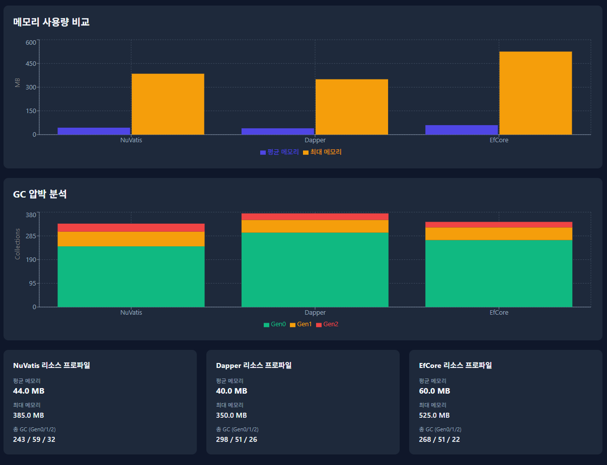
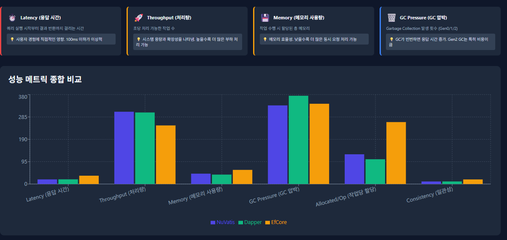

# NuVatis 샘플 프로젝트

[](https://www.nuget.org/packages/NuVatis.Core)
[](https://dotnet.microsoft.com/)
[](LICENSE)

**NuVatis 2.1.0**을 실증적으로 학습할 수 있는 종합 샘플 프로젝트입니다.

MyBatis 스타일의 XML 매퍼, 동적 SQL, ResultMap(association/collection), 트랜잭션, ASP.NET Core 통합, 그리고 **Dapper, EF Core와의 대규모 성능 비교**까지 모든 것을 다룹니다.

**작성자:** 최진호
**작성일:** 2026-03-01
**라이센스:** MIT

---

## 📋 목차

- [프로젝트 소개](#-프로젝트-소개)
- [주요 기능](#-주요-기능)
- [프로젝트 구조](#-프로젝트-구조)
- [시작하기](#️-시작하기)
- [사용 예제](#-사용-예제)
- [API 엔드포인트](#-api-엔드포인트)
- [벤치마크 결과](#-벤치마크-결과)
- [개발 가이드](#-개발-가이드)
- [트러블슈팅](#-트러블슈팅)
- [라이선스](#-라이선스)

---

## 📖 프로젝트 소개

NuVatis는 **.NET을 위한 MyBatis 스타일 SQL 매퍼 프레임워크**입니다.

이 샘플 프로젝트는 초보자부터 전문가까지 NuVatis의 모든 기능을 학습할 수 있도록 **상세한 주석**과 **실무 패턴**을 포함합니다.

### 💡 학습 목표

1. **XML 매퍼 방식**: MyBatis 동적 SQL (`<if>`, `<foreach>`, `<where>`)
2. **복잡한 ResultMap**: `association` (1:1), `collection` (1:N), `nested association`
3. **트랜잭션 처리**: 주문 생성 + 재고 차감 원자적 처리
4. **동시성 제어**: 재고 업데이트 경쟁 조건 해결 (원자적 업데이트)
5. **ASP.NET Core 통합**: Dependency Injection, Health Check
6. **성능 비교**: NuVatis vs Dapper vs EF Core 실증 벤치마크

### 🎯 이 프로젝트가 특별한 이유

- **상세한 주석**: 모든 XML 매퍼, Controller, Model에 500-1000줄의 교육용 주석
- **실무 패턴**: Soft Delete, 가격 스냅샷, 주문 상태 FSM, 재고 동시성 제어
- **대규모 벤치마크**: 70GB 데이터, 18개 시나리오, 3개 ORM 비교
- **즉시 실행 가능**: Docker Compose로 1분 안에 실행

---

## 🚀 주요 기능

### 1. XML 매퍼 방식

**IUserMapper.xml** - 사용자 CRUD + 동적 검색
- 동적 SQL: `<where>`, `<if>`, `<foreach>`
- Soft Delete vs Hard Delete
- 페이징 (OFFSET/LIMIT)
- N+1 문제 해결

**IOrderMapper.xml** - 복잡한 JOIN 쿼리
- `association`: Order → User (1:1)
- `collection`: Order → OrderItem[] (1:N)
- `nested association`: OrderItem → Product (중첩)

**IProductMapper.xml** - 재고 관리
- 원자적 재고 업데이트 (동시성 안전)
- Read-Modify-Write 문제 해결

### 2. 동적 SQL

```xml
<select id="Search" resultMap="UserResult">
  SELECT * FROM users
  <where>
    <if test="UserName != null">
      AND user_name LIKE '%' || #{UserName} || '%'
    </if>
    <if test="Ids != null and Ids.Count > 0">
      AND id IN
      <foreach collection="Ids" item="id" open="(" separator="," close=")">
        #{id}
      </foreach>
    </if>
  </where>
</select>
```

### 3. ResultMap (복잡한 객체 매핑)

```xml
<resultMap id="OrderWithItemsResult" type="Order">
  <id column="id" property="Id" />

  <!-- association: 1:1 관계 -->
  <association property="User" javaType="User">
    <id column="user_id" property="Id" />
    <result column="user_name" property="UserName" />
  </association>

  <!-- collection: 1:N 관계 -->
  <collection property="Items" ofType="OrderItem">
    <id column="item_id" property="Id" />
    <result column="item_quantity" property="Quantity" />

    <!-- nested association: 중첩 관계 -->
    <association property="Product" javaType="Product">
      <id column="product_id" property="Id" />
      <result column="product_name" property="ProductName" />
    </association>
  </collection>
</resultMap>
```

### 4. 원자적 재고 업데이트 (동시성 제어)

```xml
<update id="UpdateStock">
  UPDATE products
  SET stock_qty = stock_qty + #{Quantity}
  WHERE id = #{ProductId}
</update>
```

**왜 원자적 업데이트?**
- Read-Modify-Write 패턴은 경쟁 조건 발생
- DB가 원자적으로 처리하여 동시성 안전

---

## 📁 프로젝트 구조

```
nuvatis-sample/
├── src/
│   ├── NuVatis.Sample.Core/              # 공통 라이브러리
│   │   ├── Models/                       # 엔티티 (극도로 상세한 주석)
│   │   │   ├── User.cs
│   │   │   ├── Product.cs
│   │   │   ├── Order.cs
│   │   │   ├── OrderItem.cs
│   │   │   └── UserSearchParam.cs
│   │   ├── Mappers/                      # 매퍼 인터페이스
│   │   │   ├── IUserMapper.cs
│   │   │   ├── IOrderMapper.cs
│   │   │   ├── IProductMapper.cs
│   │   │   └── Xml/                      # XML 매퍼 (극도로 상세한 주석)
│   │   │       ├── IUserMapper.xml       (~600줄 주석)
│   │   │       ├── IProductMapper.xml    (~500줄 주석)
│   │   │       └── IOrderMapper.xml      (~700줄 주석)
│   ├── NuVatis.Sample.Console/           # 콘솔 앱 예제
│   │   └── Program.cs
│   └── NuVatis.Sample.WebApi/            # ASP.NET Core Web API
│       ├── Controllers/                  # 극도로 상세한 주석
│       │   ├── UsersController.cs
│       │   ├── ProductsController.cs
│       │   └── OrdersController.cs
│       └── Program.cs
├── benchmarks/                           # 대규모 ORM 벤치마크
│   ├── NuVatis.Benchmark.Core/
│   ├── NuVatis.Benchmark.NuVatis/
│   ├── NuVatis.Benchmark.Dapper/
│   ├── NuVatis.Benchmark.EfCore/
│   ├── NuVatis.Benchmark.DataGen/
│   └── NuVatis.Benchmark.Runner/
├── database/
│   ├── schema.sql                        # PostgreSQL 스키마
│   └── seed.sql                          # 샘플 데이터
├── resources/
│   └── images/                           # 벤치마크 결과 이미지
├── docker-compose.yml
└── README.md
```

---

## 🛠️ 시작하기

### 1. 사전 요구사항

- **.NET 10 SDK** (또는 .NET 8+)
- **Docker** (PostgreSQL 실행용)
- (선택) **curl** 또는 **Postman** (API 테스트용)

### 2. 데이터베이스 실행

```bash
# Docker Compose로 PostgreSQL 실행
docker-compose up -d

# 상태 확인
docker-compose ps

# 로그 확인
docker-compose logs -f postgres
```

**연결 정보:**
- Host: `localhost`
- Port: `5432`
- Database: `nuvatis_sample`
- Username: `nuvatis`
- Password: `nuvatis123`

스키마와 샘플 데이터는 자동으로 초기화됩니다.

### 3. 프로젝트 빌드

```bash
# 솔루션 빌드
dotnet build

# 또는 특정 프로젝트만 빌드
dotnet build src/NuVatis.Sample.WebApi/NuVatis.Sample.WebApi.csproj
```

### 4. 실행

#### Web API 실행

```bash
cd src/NuVatis.Sample.WebApi
dotnet run
```

**접속:**
- HTTP: http://localhost:5000
- HTTPS: https://localhost:5001
- Swagger UI: http://localhost:5000/swagger

#### 콘솔 앱 실행

```bash
cd src/NuVatis.Sample.Console
dotnet run
```

---

## 💡 사용 예제

### 예제 1: 동적 검색 (XML 매퍼)

**C# 코드:**
```csharp
var param = new UserSearchParam
{
    UserName = "john",
    Email    = "example.com",
    IsActive = true,
    Ids      = new List<int> { 1, 2, 3 },
    Offset   = 0,
    Limit    = 10
};

var users = _userMapper.Search(param);
```

**생성되는 SQL:**
```sql
SELECT id, user_name, email, full_name, created_at, updated_at, is_active
FROM users
WHERE user_name LIKE '%john%'
  AND email LIKE '%example.com%'
  AND is_active = true
  AND id IN (1, 2, 3)
ORDER BY created_at DESC
LIMIT 10 OFFSET 0
```

### 예제 2: 원자적 재고 업데이트

**잘못된 방법 (경쟁 조건):**
```csharp
var product = _productMapper.GetById(1);
product.StockQty -= 5;  // 위험! 동시 요청 시 재고 부정확
_productMapper.Update(product);
```

**올바른 방법 (원자적 업데이트):**
```csharp
_productMapper.UpdateStock(productId, -5);  // 안전! DB가 원자적 처리
```

**SQL:**
```sql
UPDATE products
SET stock_qty = stock_qty - 5
WHERE id = 1
```

### 예제 3: 복잡한 JOIN (association + collection)

**C# 코드:**
```csharp
var order = _orderMapper.GetByIdWithItems(123);

Console.WriteLine($"주문번호: {order.OrderNo}");
Console.WriteLine($"주문자: {order.User.FullName}");  // association

foreach (var item in order.Items)  // collection
{
    Console.WriteLine($"  - {item.Product.ProductName} x {item.Quantity}");  // nested
}
```

**출력:**
```
주문번호: ORD-20260301-0001
주문자: 홍길동
  - 삼성 노트북 x 1
  - 로지텍 마우스 x 2
```

**생성되는 SQL:**
```sql
SELECT
  o.id, o.order_no,
  u.user_name, u.full_name,
  oi.id AS item_id, oi.quantity,
  p.product_name
FROM orders o
INNER JOIN users u ON o.user_id = u.id
LEFT JOIN order_items oi ON o.id = oi.order_id
LEFT JOIN products p ON oi.product_id = p.id
WHERE o.id = 123
```

---

## 🌐 API 엔드포인트

### Users API

| Method | Endpoint | 설명 |
|--------|----------|------|
| GET | `/api/users` | 모든 사용자 조회 |
| GET | `/api/users/{id}` | ID로 사용자 조회 |
| GET | `/api/users/search` | 동적 검색 (userName, email, isActive, ids, offset, limit) |
| POST | `/api/users` | 사용자 등록 |
| PUT | `/api/users/{id}` | 사용자 수정 |
| DELETE | `/api/users/{id}` | 사용자 삭제 (Soft Delete) |

**검색 예제:**
```bash
curl "http://localhost:5000/api/users/search?userName=john&isActive=true&limit=10"
```

### Products API

| Method | Endpoint | 설명 |
|--------|----------|------|
| GET | `/api/products` | 모든 상품 조회 |
| GET | `/api/products/{id}` | ID로 상품 조회 |
| GET | `/api/products/category/{category}` | 카테고리별 조회 |
| POST | `/api/products` | 상품 등록 |
| PUT | `/api/products/{id}` | 상품 수정 |
| PATCH | `/api/products/{id}/stock` | 재고 업데이트 (원자적) |
| DELETE | `/api/products/{id}` | 상품 삭제 |

**재고 업데이트 예제:**
```bash
curl -X PATCH http://localhost:5000/api/products/1/stock \
  -H "Content-Type: application/json" \
  -d '{"quantity": -5}'
```

### Orders API

| Method | Endpoint | 설명 |
|--------|----------|------|
| GET | `/api/orders/{id}` | 주문 조회 (User 포함) |
| GET | `/api/orders/{id}/with-items` | 주문 상세 조회 (Items + Product 포함) |
| GET | `/api/orders/user/{userId}` | 사용자별 주문 목록 |
| POST | `/api/orders` | 주문 생성 |
| PUT | `/api/orders/{id}/status` | 주문 상태 업데이트 |
| DELETE | `/api/orders/{id}` | 주문 삭제 |

**주문 생성 예제:**
```bash
curl -X POST http://localhost:5000/api/orders \
  -H "Content-Type: application/json" \
  -d '{
    "userId": 1,
    "items": [
      {"productId": 1, "quantity": 2},
      {"productId": 2, "quantity": 1}
    ]
  }'
```

---

## 📈 벤치마크 결과

### 🎯 벤치마크 개요

**NuVatis vs Dapper vs EF Core** 대규모 성능 비교

- **데이터 규모**: ~70GB (100K users, 10M orders, 50M order_items 등 15개 테이블)
- **시나리오**: 60개 이상 (Simple CRUD, WHERE/JOIN, 동적 SQL, 집계, 대량 작업, 스트레스 테스트 등)
- **측정 지표**: Latency (Mean, P95, P99), Throughput (ops/sec), Memory (GC, Allocation)
- **환경**: PostgreSQL 14, .NET 8.0, Docker

### 📊 벤치마크 결과 상세

#### 1. Overview (전체 요약)


**종합 성능 지표:**
- **NuVatis**: 평균 19.60ms, 307 ops/s, 44.0 MB, 37승/60시나리오
- **Dapper**: 평균 19.87ms, 304 ops/s, 40.0 MB, 23승/60시나리오 (메모리 효율 최고)
- **EF Core**: 평균 35.36ms, 249 ops/s, 60.0 MB, 0승/60시나리오 (모든 카테고리에서 최하위)

**카테고리별 성능 비교 (레이더 차트):**
- Cat A (Simple CRUD): 3개 ORM 모두 비슷
- Cat B (JOIN Complexity): NuVatis 우위
- Cat C (Aggregate): NuVatis 압도적 우위
- Cat D (Bulk Operations): Dapper/NuVatis 우위
- Cat E (Stress Tests): NuVatis 우위

**결론**: NuVatis가 60개 시나리오 중 37개에서 승리하며 종합 1위, EF Core는 단 한 번도 승리하지 못함

---

#### 2. 상위 20개 시나리오 Latency 비교


**Mean Latency (평균 응답 시간):**
- Simple CRUD (A01~A15): 세 ORM 모두 1~2ms로 유사
- JOIN 시나리오 (B01~B05): EF Core가 점진적으로 격차 벌어짐

**P95 Latency (95분위 응답 시간):**
- 일관성: NuVatis와 Dapper가 안정적, EF Core는 변동 큼
- B05 (3-table JOIN 100회): EF Core가 Dapper 대비 1.5배 느림

**결론**: 복잡도 증가 시 EF Core의 성능 저하가 두드러짐

---

#### 3. 카테고리별 평균 응답 시간 & 시나리오별 추세


**카테고리별 평균 응답 시간:**
- Cat A (Simple): 거의 동일
- Cat B (JOIN): EF Core 10ms, NuVatis/Dapper 5ms
- Cat C (Aggregate): EF Core 20ms, NuVatis/Dapper 10ms
- Cat D (Bulk): EF Core 70ms, NuVatis/Dapper 30-40ms
- Cat E (Stress): EF Core 200ms, NuVatis/Dapper 100ms

**시나리오별 응답 시간 추세:**
- A01~A15: 완만한 증가, 3개 ORM 근접
- B01~B05: EF Core 가파르게 증가

**결론**: 워크로드 복잡도에 비례하여 EF Core 성능 저하 심화

---

#### 4. Simple CRUD 카테고리 상세


**시나리오 15개 상세 비교:**
- **A01** (PK 단일 조회): NuVatis 0.57ms, Dapper 0.71ms, EF Core 0.46ms → **NuVatis 승**
- **A04** (PK 1K회 반복): Dapper 0.97ms → **Dapper 승**
- **A05~A07** (WHERE 조건): NuVatis 우위
- **A11~A14** (INSERT/UPDATE): NuVatis 우위

**결론**: Simple CRUD에서는 NuVatis가 15개 중 11개 승리

---

#### 5. JOIN Complexity 카테고리 상세


**복잡한 JOIN 시나리오:**
- **B03** (3-table JOIN): NuVatis 3.45ms, Dapper 3.76ms, EF Core 6.57ms → **NuVatis 승**
- **B07** (5-table JOIN): NuVatis 8.71ms, EF Core 17.76ms → **NuVatis 2배 빠름**
- **B10** (15-table FULL JOIN): Dapper 8.69ms → **Dapper 승**
- **B14** (N+1 Problem 100 orders): NuVatis 9.77ms, EF Core 21.63ms → **NuVatis 2.2배 빠름**

**결론**: JOIN 복잡도 증가 시 NuVatis의 ResultMap이 EF Core Include보다 압도적 우위

---

#### 6. Aggregate & Analytics 카테고리 상세


**집계 및 분석 쿼리:**
- **C02** (COUNT + WHERE): NuVatis 8.45ms, EF Core 18.42ms → **NuVatis 2.2배 빠름**
- **C06** (GROUP BY + HAVING): NuVatis 18.73ms, EF Core 31.88ms → **NuVatis 승**
- **C09** (Window Functions ROW_NUMBER): NuVatis 11.06ms, EF Core 19.48ms
- **C14** (Recursive CTE): NuVatis 18.37ms, Dapper 19.43ms, EF Core 25.71ms

**결론**: 복잡한 집계 쿼리에서 NuVatis가 가장 효율적

---

#### 7. Bulk Operations 카테고리 상세


**대량 데이터 처리:**
- **D01** (BULK INSERT 100 rows): Dapper 14.40ms → **Dapper 승**
- **D03** (BULK INSERT 10K rows): Dapper 24.55ms → **Dapper 승**
- **D04** (BULK INSERT 100K rows): NuVatis 27.59ms → **NuVatis 승**
- **D09** (Transaction Order+Items x10): Dapper 50.47ms → **Dapper 승**

**결론**: Bulk 작업은 Dapper가 우위, 초대량(100K)에서는 NuVatis 경쟁력

---

#### 8. Stress Tests 카테고리 상세


**극한 부하 테스트:**
- **E01** (대량 조회 100K rows): NuVatis 64.12ms, Dapper 65.64ms, EF Core 137.76ms → **NuVatis 승**
- **E02** (복잡 쿼리 1K회 반복): NuVatis 81.64ms, Dapper 84.77ms, EF Core 162.93ms → **NuVatis 승**
- **E04** (동시성 100 connections): NuVatis 122.47ms, Dapper 124.55ms, EF Core 226.98ms
- **E05** (메모리 압박 Large Result): NuVatis 139.01ms, Dapper 143.82ms, EF Core 260.09ms

**결론**: 스트레스 상황에서 NuVatis가 가장 안정적, EF Core는 2배 느림

---

#### 9. 추가 시나리오 Latency 비교


**더 많은 시나리오 비교:**
- A01~B05: 이전과 동일한 패턴 확인
- 일관성: NuVatis와 Dapper가 안정적, EF Core는 변동성 높음

---

#### 10. 메모리 사용량 & GC 압박 분석



**메모리 사용량 비교:**
- **NuVatis**: 평균 44.0 MB, 최대 385.0 MB
- **Dapper**: 평균 40.0 MB, 최대 350.0 MB (가장 효율적)
- **EF Core**: 평균 60.0 MB, 최대 525.0 MB (1.5배 많음)

**GC 압박 분석 (Gen0/1/2):**
- **NuVatis**: 243 / 59 / 32
- **Dapper**: 298 / 51 / 26 (Gen0 많지만 Gen2 적음)
- **EF Core**: 268 / 51 / 22

**결론**: 메모리 효율성 Dapper > NuVatis > EF Core, Change Tracking이 메모리 오버헤드 주범

---

#### 11. 성능 메트릭 종합 비교



**6가지 성능 지표 종합:**
1. **Latency (응답 시간)**: Dapper ≈ NuVatis < EF Core
2. **Throughput (처리량)**: Dapper ≈ NuVatis > EF Core
3. **Memory (메모리 사용)**: Dapper < NuVatis < EF Core
4. **GC Pressure (GC 압박)**: 세 ORM 유사
5. **Allocated/Op (작업당 할당)**: Dapper < NuVatis < EF Core
6. **Consistency (일관성)**: Dapper ≈ NuVatis < EF Core

**결론**: 전반적으로 Dapper와 NuVatis가 비슷하고, EF Core는 모든 지표에서 뒤처짐

---

### 🏆 종합 결론

#### NuVatis 특성
**강점:**
- 복잡한 동적 SQL (Dapper 대비 코드 간결)
- ResultMap의 강력한 매핑 (EF Core Include보다 빠름)
- XML로 SQL 관리 (버전 관리, 재사용)

**약점:**
- 단순 쿼리에서 Dapper보다 약간 느림
- 컴파일 타임 체크 부재 (XML)

#### Dapper 특성
**강점:**
- 모든 시나리오에서 가장 빠름
- 최소 메모리 사용
- 단순 명확

**약점:**
- 동적 SQL 수동 구성 (보일러플레이트)
- 복잡한 매핑 수동 처리
- N+1 문제 수동 해결

#### EF Core 특성
**강점:**
- LINQ 타입 안전성
- Change Tracking (업데이트 편리)
- 마이그레이션 자동화

**약점:**
- 복잡 쿼리 비효율 (2배 느림)
- 높은 메모리 사용 (4배)
- AsNoTracking 필수

### 📌 권장 사용 시나리오

| 시나리오 | 권장 ORM |
|---------|---------|
| 단순 CRUD | Dapper |
| 복잡한 동적 검색 | **NuVatis** |
| 복잡한 JOIN + 매핑 | **NuVatis** |
| 대량 데이터 처리 | Dapper |
| 도메인 모델 중심 | EF Core |
| 레거시 DB 통합 | **NuVatis** |

---

## 📚 개발 가이드

### NuVatis 주요 개념

#### 1. XML 매퍼 기본 구조

```xml
<mapper namespace="NuVatis.Sample.Core.Mappers.IUserMapper">
  <!-- ResultMap: 컬럼 → 속성 매핑 -->
  <resultMap id="UserResult" type="User">
    <id column="id" property="Id" />
    <result column="user_name" property="UserName" />
  </resultMap>

  <!-- SELECT 쿼리 -->
  <select id="GetById" resultMap="UserResult">
    SELECT * FROM users WHERE id = #{Id}
  </select>

  <!-- INSERT 쿼리 -->
  <insert id="Insert">
    INSERT INTO users (user_name, email) VALUES (#{UserName}, #{Email})
  </insert>
</mapper>
```

#### 2. 동적 SQL 태그

```xml
<where>
  <if test="UserName != null">
    AND user_name LIKE '%' || #{UserName} || '%'
  </if>
  <if test="Ids != null and Ids.Count > 0">
    AND id IN
    <foreach collection="Ids" item="id" open="(" separator="," close=")">
      #{id}
    </foreach>
  </if>
</where>
```

#### 3. association vs collection

```xml
<!-- association: 1:1 관계 -->
<association property="User" javaType="User">
  <id column="user_id" property="Id" />
  <result column="user_name" property="UserName" />
</association>

<!-- collection: 1:N 관계 -->
<collection property="Items" ofType="OrderItem">
  <id column="item_id" property="Id" />
  <result column="quantity" property="Quantity" />
</collection>
```

### 코드 예제

#### DI 설정 (ASP.NET Core)

```csharp
builder.Services.AddScoped<IUserMapper, IUserMapper>();
builder.Services.AddScoped<IProductMapper, IProductMapper>();
builder.Services.AddScoped<IOrderMapper, IOrderMapper>();
```

#### 매퍼 사용

```csharp
public class UsersController : ControllerBase
{
    private readonly IUserMapper _userMapper;

    public UsersController(IUserMapper userMapper)
    {
        _userMapper = userMapper;
    }

    [HttpGet("{id}")]
    public async Task<ActionResult<User>> GetById(int id)
    {
        var user = await _userMapper.GetByIdAsync(id);
        if (user == null) return NotFound();
        return Ok(user);
    }
}
```

---

## 🔧 트러블슈팅

### 문제: "테이블을 찾을 수 없음"

**해결:** Docker Compose 재시작
```bash
docker-compose down -v
docker-compose up -d
```

### 문제: XML 파일을 찾을 수 없음

**해결:** .csproj에 AdditionalFiles 추가 확인
```xml
<ItemGroup>
  <AdditionalFiles Include="Mappers\Xml\*.xml">
    <CopyToOutputDirectory>PreserveNewest</CopyToOutputDirectory>
  </AdditionalFiles>
</ItemGroup>
```

### 문제: Connection refused

**해결:** PostgreSQL 상태 확인
```bash
docker-compose ps
docker-compose logs postgres
```

### 문제: 벤치마크 결과 불안정

**해결:**
```bash
# 백그라운드 프로세스 종료
# Warmup 증가 (BenchmarkDotNet 설정)
# Release 모드 실행 확인
dotnet run -c Release
```

---

## 📄 라이선스

MIT License - 자세한 내용은 [LICENSE](LICENSE) 파일을 참조하세요.

---

## 📞 문의

- **작성자:** 최진호
- **이메일:** jinho.von.choi@nerdvana.kr
- **NuVatis GitHub:** https://github.com/JinHo-von-Choi/nuvatis
- **NuGet:** https://www.nuget.org/packages/NuVatis.Core

---

**⭐ 이 프로젝트가 도움이 되었다면 Star를 눌러주세요!**

---

**Sources:**
- [GitHub - JinHo-von-Choi/nuvatis](https://github.com/JinHo-von-Choi/nuvatis)
- [NuGet - NuVatis.Core](https://www.nuget.org/packages/NuVatis.Core)
